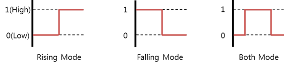

# GPIO

[GPIO](https://en.wikipedia.org/wiki/General-purpose_input/output) (General-Purpose Input/Output) is a programmable interface for reading the state of binary input peripherals, such as a switch, and controlling the state of binary output peripherals, such as a LED.

GPIO sets a direction for the data transfer. It can also detect an interrupt signaled by a level transition: either a falling edge (high to low) or a rising edge (low to high). To detect the interrupt signal you want, set the appropriate edge mode.

GPIO offers the following edge modes:

-   Rising mode detects data changes from low to high.
-   Falling mode detects data changes from high to low.

**Figure: GPIO edge modes**



## Opening and Closing a Handle

To open and close a handle:

1.  To open a GPIO handle, create `GpioPin` object:

    ```csharp
    int pin = 26; /* Raspberry Pi 3 and Raspberry Pi 4 : GPIO26 */
    GpioPin gpio = new GpioPin(pin, GpioPinDriveMode.Input);
    ```

    The `pin` parameter required for this function must be set according to the following tables.

    **Table: Raspberry Pi 3 and Raspberry Pi 4**

      Pin name  |Pin (parameter 1)  |Pin name  |Pin (parameter 1)
      ----------|-------------------|----------|-------------------
      GPIO4     |4                  |GPIO5     |5
      GPIO6     |6                  |GPIO12    |12
      GPIO13    |13                 |GPIO16    |16
      GPIO17    |17                 |GPIO18    |18
      GPIO19    |19                 |GPIO20    |20
      GPIO21    |21                 |GPIO22    |22
      GPIO23    |23                 |GPIO24    |24
      GPIO25    |25                 |GPIO26    |26
      GPIO27    |27                 |-         |-

    > **Note**
    >
    >  For more information on the pin names and locations, see [Supported Protocols](peripheral.md#protocol).

2.  To close a GPIO handle that is no longer used, use the `gpio.Close()` method:

    ```csharp
    gpio.Close();
    ```

## Setting the Data Direction

Gpio object constructor expect the data transfer direction parameter. It can be set to:

-   `GpioPinDriveMode.Input`: Input mode to receive data from a binary output peripheral.
-   `GpioPinDriveMode.OutputInitiallyLow`: Output mode to send data to a binary output peripheral. This value initializes the output peripheral state as low.
-   `GpioPinDriveMode.OutputInitiallyHigh`: Output mode to send data to a binary output peripheral. This value initializes the output peripheral state as high.

> **Note**
>
> To set the data direction to `GpioPinDriveMode.OutputInitiallyHigh` or `GpioPinDriveMode.OutputInitiallyLow`, the edge mode must be set to `GpioChangePolarity.None`.


## Setting the Edge Mode

To set the edge mode, use the `gpio.Polarity` property with 1 of the following edge mode types:

-   `GpioChangePolarity.None`: No edge mode.
-   `GpioChangePolarity.Rising`: Interrupted at a rising edge (low to high).
-   `GpioChangePolarity.Falling`: Interrupted at a falling edge (high to low).
-   `GpioChangePolarity.Both`: Interrupted at both rising and falling edges.

```csharp
GpioPin.Polarity(GpioChangePolarity);
```

> **Note**
>
> To set the edge mode to `GpioChangePolarity.Rising`, `GpioChangePolarity.Falling`, or `GpioChangePolarity.Both`, the data direction must be set to the `GpioPinDriveMode.Input`.


## Setting the Interrupted Callback

The interrupted event handler is called when the GPIO state changes, based on the selected edge mode.

To implement the interrupted callback:

1.  Subscribe to the interrupted event handler.

    ```csharp
    GpioPin gpio;
    gpio.ValueChanged += myEventHandler;
    ```
2.  When no longer needed, unsubscribe the interrupt event handler:

    ```csharp
    gpio.ValueChanged -= myEventHandler;
    ```

## Reading and Writing Binary Data

To read and write binary data:

-   To read binary data from a peripheral, use the `GpioPin.Read()` method:

    ```csharp
    GpioPinValue value;
    value = gpio.Read();
    ```

-   To write binary data to a peripheral, use the `GpioPin.Write()` method:

    ```csharp
    GpioPinValue value = GpioPinValue.Low;
    gpio.Write(value);
    ```

> **Note**
>
> To write binary data, the data direction must be set to `GpioPinDriveMode.OutputInitiallyHigh` or `GpioPinDriveMode.OutputInitiallyLow`.
