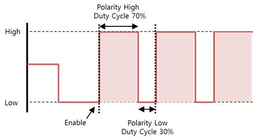
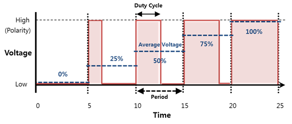

# PWM

[PWM](https://en.wikipedia.org/wiki/Pulse-width_modulation) (Pulse-Width Modulation) is a programmable interface that allows you to, for example, control motor speed or change light brightness.

Peripherals that support PWM are controlled by the current strength. To modulate the current, the voltage needs to be modulated. The voltage is proportional to the intensity of the current.

To modulate the voltage, you must set the duty cycle and polarity:

-   The period is a constant interval at which the pulse repeats.
-   The duty cycle is the constant time within 1 period in which a signal is active.
-   A "polarity high" signal starts high for the duration of the duty cycle and goes low for the remainder of the period. Conversely, a "polarity low" signal starts low for the duration of the duty cycle and goes high for the remainder of the period.
-   The pulse repeats if repetition has been enabled.

**Figure: Duty cycle**



For example, if the period is 10,000,000 nanoseconds and the polarity high duty cycle is 7,000,000 nanoseconds, the average voltage is at 70%.

**Figure: Average voltage per duty cycle**



## Opening and Closing a Handle

To open and close a handle:

1.  To open a PWM handle, create the `PwmPin()` object:

    ```csharp
    int chip = 0;
    int pin = 2;
    PwmPin pwm = new PwmPin(chip, pin);
    ```

    > **Note**
    >
    > For more information on the pin names and locations, see [Supported Protocols](peripheral.md#protocol).

2.  To close a PWM handle that is no longer used, use the `PwmPin.Close()` method:

    ```csharp
    pwm.Close();
    ```

## Setting the Period

To set the period, use the `PwmPin.Period` property.

The following example sets the period to 20 milliseconds. The unit is nanoseconds.

```csharp
uint period = 20000000;
pwm.Period = period;
```

## Setting the Duty Cycle

To set the duty cycle, use the `PwmPin.DutyCycle` property.

The following example sets the duty cycle to 2 milliseconds. The unit is nanoseconds.

```csharp
uint duty_cycle = 2000000;
pwm.DutyCycle = duty_cycle;
```

## Setting the Polarity

To set the polarity, use the `PwmPin.Polarity()` method with 1 of the following `PwmPulsePolarity` types:

-   `PwmPulsePolarity.ActiveHigh`: Polarity is high.
-   `PwmPulsePolarity.ActiveLow`: Polarity is low.

```csharp
pwm.PwmPulsePolarity = PwmPulsePolarity.ActiveHigh;
```

## Enabling Repetition

To enable repetition, use the `PwmPin.Enable()` method:

```csharp
bool enable = true;
pwm.Enable = enable;
```
