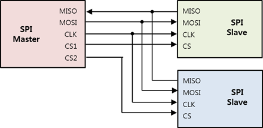
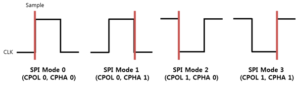

# SPI

[SPI](https://en.wikipedia.org/wiki/Serial_Peripheral_Interface_Bus) (Serial Peripheral Interface) is a programmable interface for transferring data quickly to peripherals that require high performance.

The SPI protocol is a serial communication method that controls the clock signal as master and other peripherals connected to SPI as slaves. This protocol is used by peripherals, such as heart-beat pulse sensors and graphic displays, that require fast data transfer.

**Figure: SPI interface diagram**



The SPI is a communication method between 1 master and multiple slave devices. In the above figure:

-   CLK (SCLK or SCK) is a simple synchronization signal and a communication clock.
-   The data flows from the master to the slave in the MOSI (Master Out Slave In) line, and from the slave to the master in the MISO (Master In Slave Out) line. Full duplex data communication is possible with 2 lines (MOSI and MISO).
-   CS (Chip Select) is a signal for selecting a slave device.

SPI supports half duplex read/write and full duplex transfer.

To use SPI, you must set the following:

-   SPI mode

    **Figure: SPI modes**

    

    Each of the 4 available SPI modes defines a specific combination of clock polarity (CPOL) and clock phase (CPHA).

    **Table: SPI modes**

    | SPI mode   | Polarity (CPOL) | Phase (CPHA) | Description                                                  |
    | ---------- | --------------- | ------------ | ------------------------------------------------------------ |
    | SPI MODE 0 | 0               | 0            | CLK (Clock) is first low and data is sampled on the rising edge of each clock pulse. |
    | SPI MODE 1 | 0               | 1            | CLK is first low and data is sampled on the falling edge of each clock pulse. |
    | SPI MODE 2 | 1               | 0            | CLK is first high and data is sampled on the falling edge of each clock pulse. |
    | SPI MODE 3 | 1               | 1            | CLK is first high and data is sampled on the rising edge of each clock pulse. |

-   Bit order

    The bit order refers to the sequential order in which bytes are arranged into larger numerical values. MSB indicates that the most significant bit is transmitted first. LSB indicates that the least significant bit is transmitted first.

-   Bit per word

    The bit per word refers to the number of bits to be transmitted at a time when data is exchanged with a connected slave. Normally, it is set to 8 bits per word.

-   Frequency

    The frequency refers to the clock signal in Hz. Since the frequencies are different for each slave device, the applicable value must be checked from the peripheral's specification.

## Opening and Closing a Handle

To open and close a handle:

1.  To open a SPI handle, create the `SpiDevice()` object:

    ```csharp
    int bus = 2;
    int chip_select = 0;
    SpiDevice spi = new SpiDevice(bus, chip_select);
    ```

    The `bus` and `chip_select` parameters required for this function must be set according to the following tables.

    **Table: Raspberry Pi 3 and Raspberry Pi 4**

    | Pin name  | | | | Bus (parameter 1) | Chip Select (parameter 2) |
    | --------- | --------- | -------- | -------- | ---- | ---- |
    | SPI0_MOSI | SPI0_MISO | SPI0_CLK | SPI0_CS0 | 0    | 0    |
    | SPI0_MOSI | SPI0_MISO | SPI0_CLK | SPI0_CS1 | 0    | 1    |

    > **Note**
    >
    > For more information on the pin names and locations, see [Supported Protocols](peripheral.md#protocol).

2.  To close a SPI handle that is no longer used, use the `SpiDevice.Close()` method:

    ```csharp
    spi.Close();
    ```

## Setting the SPI Mode

To set the SPI mode, use the `SpiDevice.Mode` property with 1 of the following `SpiMode` types:

-   `SpiMode.Mode0`: CLK is active high and sampled at the rising edge.
-   `SpiMode.Mode1`: CLK is active high and sampled at the falling edge.
-   `SpiMode.Mode2`: CLK is active low and sampled at the rising edge.
-   `SpiMode.Mode3`: CLK is active low and sampled at the falling edge.

```csharp
spi.Mode = SpiMode.Mode0;
```

## Setting the Bit Order

To set the bit order, use the `SpiDevice.BitOrder` property with 1 of the following `BitOrder` types:

-   `BitOrder.MSB`: Use the most significant bit first.
-   `BitOrder.LSB`: Use the least significant bit first.

```csharp
spi.BitOrder = BitOrder.MSB;
```

> **Note**
>
> The Raspberry Pi 3 and Raspberry Pi 4 boards do not support the LSB bit order.

## Setting the Bits per Word

To set the bits per word, use the `SpiDevice.BitsPerWord` property:

```csharp
byte bits_per_word = 8;
spi.BitsPerWord = bits_per_word;
```

## Setting the Frequency

To set the frequency, use the `SpiDevice.ClockFrequency` property.

The frequency unit is Hz.

```csharp
uint frequency = 1024;
spi.ClockFrequency  = frequency;
```

## Reading, Writing, and Transferring Data

To read, write, and transfer data:

-   To read data from a slave device, use the `SpiDevice.Read()` method:

    ```csharp
    byte[] data = new byte[1];
    spi.Read(data);
    ```

-   To write data to a slave device, use the `SpiDevice.Write()` method:

    ```csharp
    byte[] data = {0x80};
    spi.Write(data);
    ```

-   To exchange bytes data with a slave device, use the `SpiDevice.TransferSequential()` method:

    ```csharp
    byte[] tx_data = {0x80, 0x01};
    byte[] rx_data = new byte[2];
    spi.TransferSequential(tx_data, rx_data);
    ```
