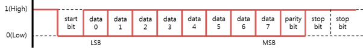

# UART

[UART](https://en.wikipedia.org/wiki/Universal_asynchronous_receiver-transmitter) (Universal Asynchronous Receiver-Transmitter) is a programmable interface that allows you to communicate 1:1 with a UART peripheral.

**Figure: UART interface diagram**


UART is an interface for exchanging data with peripherals. It is an asynchronous method that transmits data without a clock line, and consists of only 2 data lines: transmit (Tx) and receive (Rx). UART performs 1:1 communication.

**Figure: UART data frame**



The UART data frame consists of start (1 bit), data (5\~8 bit), parity (1 bit) and stop (1 bit):

-   Start bit

    Indicates the start of the communication before sending data and holds it for a bit time length.

-   Data

    Transmits 5 to 8 bits of data.

-   Parity bit

    Generates and transmits a parity value for error verification, and determines a receiving side error. The following options are available: `None`, `Even`, and `Odd` parity. Selecting `None` removes this bit.

-   Stop bit

    Indicates the termination of the communication and holds 1 or 2 bits.

-   Baud rate

    Asynchronous transmission/receiving speeds must be matched to the peripheral. For this purpose, the number of signals transmitted per second can be synchronized with a peripheral. It is called the Baud.

If a device supports a 5-wire UART port, hardware flow control can be used to increase the reliability of the data transmission. Software flow control can also be used to increase reliability.

## Opening and Closing a Handle

To open and close a handle:

1.  To open a UART handle, create the `SerialPort()` object:

    ```csharp
    int port = 0;
    SerialPort uart = new SerialPort(port);
    ```

    The `port` parameter required for this function must be set according to the following tables.

    **Table: Raspberry Pi 3 and Raspberry Pi 4**

    | Pin name | | Port (parameter 1) |
    | -------- | ---------| ---- |
    | UART0_RX | UART0_TX | 0    |
    | UART1_RX | UART1_TX | 1    |


    > **Note**
    >
    > For more information on the pin names and locations, see [Supported Protocols](peripheral.md#protocol).

2.  To close a UART handle that is no longer used, use the `SerialPort.Close()` method:

    ```csharp
    uart.Close();
    ```

## Setting the Baud Rate

To set the baud rate, use the `SerialPort.BaudRate` property with a `BaudRate` value:

-   `BaudRate.Rate0` \~ `BaudRate.Rate230400`

```csharp
uart.BaudRate = BaudRate.Rate9600;
```

## Setting the Byte Size

To set the byte size, use the `SerialPort.DataBits` property with 1 of the following `DataBits` types:

-   `DataBits.Size5Bit`: Byte size is 5 bits.
-   `DataBits.Size6Bit`: Byte size is 6 bits.
-   `DataBits.Size7Bit`: Byte size is 7 bits.
-   `DataBits.Size8Bit`: Byte size is 8 bits.

```csharp
uart.DataBits = DataBits.Size7Bit;
```

## Setting the Parity Bit

To set the parity bit, use the `SerialPort.Parity` property with 1 of the following `Parity` types:

-   `Parity.None`: No parity bit.
-   `Parity.Even`: Parity bit is even.
-   `Parity.Odd`: Parity bit is odd.

```csharp
uart.Parity = Parity.Even;
```

## Setting the Stop Bits

To set the stop bits, use the `SerialPort.StopBits` property with 1 of the following `StopBits` types:

-   `StopBits.One`: 1 bit is used for stop bits.
-   `StopBits.Two`: 2 bit is used for stop bits.

```csharp
uart.StopBits = StopBits.Two;
```

## Setting the Flow Control

To set the software flow control, use the `SerialPort.SoftwareFlowControl` property with 1 of the following `SoftwareFlowControl` types:

-   `SoftwareFlowControl.None`: No software flow control.
-   `SoftwareFlowControl.XonXoff`: Software flow control uses XONXOFF.

```csharp
uart.SoftwareFlowControl(SoftwareFlowControl.XonXoff);
```

To set the hardware flow control, use the `SerialPort.HardwareFlowControl` property with 1 of the following `HardwareFlowControl` types:
-   `HardwareFlowControl.None`: No hardware flow control.
-   `HardwareFlowControl.AutoRtsCts`: Hardware flow control uses RTSCTS.

```csharp
uart.HardwareFlowControl(HardwareFlowControl.AutoRtsCts);
```

## Reading and Writing Data

To read and write data:

-   To write data to a slave device, use the `SerialPort.Write()` method:

    ```csharp
    byte[] data = {0x06, 0x01};
    int offset = 0;
    SerialPort.Write(data, offset, data.Length);
    ```

-   To read data from a slave device, use the `SerialPort.Read()` method:

    ```csharp
    byte[] data = new byte[2];
    int offset = 0;
    SerialPort.Read(data, offset, data.Length);
    ```
