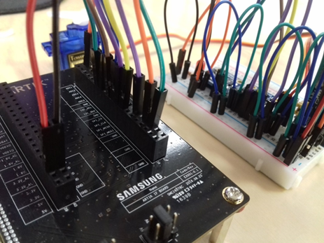
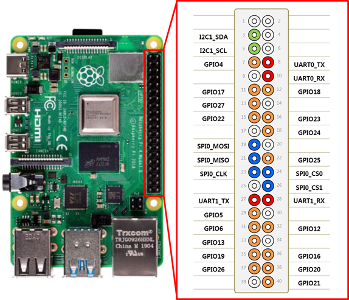

# Tizen Peripheral I/O Native API

Tizen IoT provides the Peripheral I/O APIs for IoT devices to control peripherals, such as sensors and actuators, using industry-standard protocols and interfaces:

-   [GPIO](peripheral-gpio.md) (General-Purpose Input/Output)
-   [PWM](peripheral-pwm.md) (Pulse-Width Modulation)
-   [SPI](peripheral-spi.md) (Serial Peripheral Interface)
-   [I<sup>2</sup>C](peripheral-i2c.md) (Inter-Integrated Circuit)
-   [UART](peripheral-uart.md) (Universal Asynchronous Receiver-Transmitter)

Since each peripheral supports different interfaces and protocols, you must check from the peripheral's specifications whether a specific protocol is supported. Peripheral I/O APIs are categorized based on the protocol.

**Figure: Peripherals connected to an IoT device**



<a name="protocol"></a>
## Supported Protocols

The following table lists the supported protocols for the Tizen IoT hardware targets.

**Table: Protocols supported by the Tizen IoT hardware targets**

  | Protocol  |Raspberry Pi 3 and Raspberry Pi 4 |
  |-----------|----------------------------------|
  | GPIO      |Yes |
  | PWM       |No |
  | SPI       |Yes |
  | I<sup>2</sup>C |Yes |
  | UART      |Yes |

The following figures illustrate the pinout information for the Tizen IoT hardware targets.

**Figure: Raspberry Pi 3 and Raspberry Pi 4 pinout**



## Prerequisites

1.  To use the Peripheral I/O API, the application has to request permission by adding the following platform privilege to the `tizen-manifest.xml` file:

    ```xml
    <privileges>
       <privilege>http://tizen.org/privilege/peripheralio</privilege>
    </privileges>
    ```

    To obtain authorization to use platform-level privileges, the application must be signed with a **platform-level distributor** certificate. Please follow [this guide](https://docs.tizen.org/application/vstools/tools/certificate-manager/) on how to create a certificate profile for signing the application. In third section of creating certificate "Distributor Certificate" please select "Select a distributor certificate for an another app store" and provide **platform-level distributor** certificate obtained from Samsung.

2.  To use the classes and data types of the Peripheral I/O API please use `Tizen.Peripheral` namespace.
