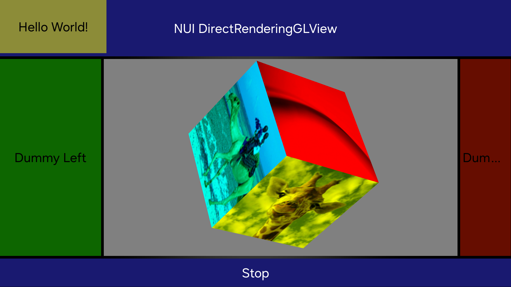
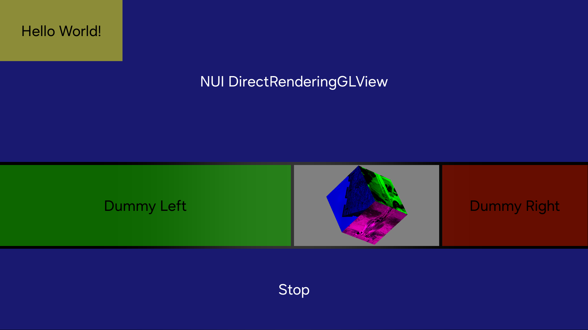
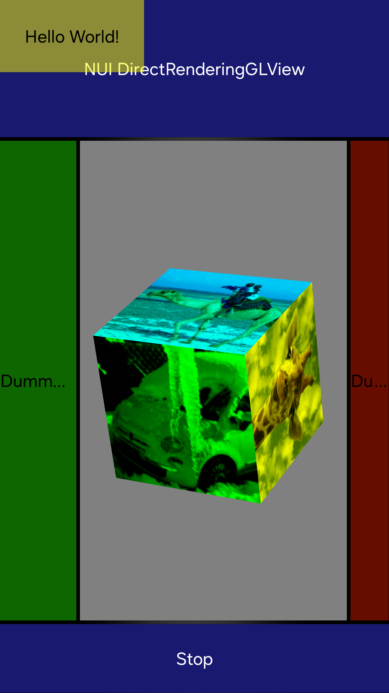

# DirectRenderingGLViewSample

This app shows how to use DirectRenderingGLView. DirectRenderingGLView is a View. So you can use it with the other components and add it to layouts.

There are two ways to use OpenGL ES.
In C#, you can use OpenTK. If you want to use the native OpenGL ES library, you can register native symbols to its callbacks. You can check how to create a SO file in the GLViewDRNativeSo directory.

## Preview
* Screenshot


* Resize DirectRenderingGLView


* Rotate window surface


## Programming guide
DirectRenderingGLView has difference behavior per each BackendMode.


|`BackendMode`|Context|RenderThread|
|------|---|---|
|`DirectRendering`|Owned|Platform RenderThread|
|`DirectRenderingThread`|Owned|Owned|
|`EglImageOffscreenRendering`|Owned|Owned|
|`UnsafeDirectRendering`|Platform Context (Unsafe!)|Platform RenderThread|

You can register three callbacks related to GL calls.
```csharp
public void RegisterGLCallbacks(GLInitializeDelegate glInit, GLRenderFrameDelegate glRenderFrame, GLTerminateDelegate glTerminate)
```

And you can bind Textures.
```csharp
public void BindTextureResources(List<Texture> textures)
```

Every frame, read-only infomations `DirectRenderingGLView.RenderCallbackInput` comes by `GLRenderFrameDelegate`.

|Property Name|Type|Description|
|------|---|---------|
|`Mvp`|`Matrix`|Model-View-Projection matrix of DirectRenderingGLView|
|`Projection`|`Matrix`|Projection matrix of DirectRenderingGLView|
|`Size`|`Size2D`|Current size of DirectRenderingGLView|
|`ClippingBox`|`Rectangle`|Screen coordinate of DirectRenderingGLView. You can call `glScissor` by given value|
|`TextureBindings`|`ReadOnlyCollection<int>`|List of texture ids what we call `BindTextureResources`. You can call `glBindTexture` by given value|

The GL rendering thread calls the three GL callbacks. So you don't have to consider syncing threads. But when you handle events that change rendering status, You have to add mutex locks because event handling callbacks in NUI are invoked in the main(event) thread.

You can use native symbols like below. The `initializeGL()` is in the `libglview-callbacks.so.0.0.1 file`.

```csharp
const string lib = "libglview-callbacks.so.0.0.1";
[global::System.Runtime.InteropServices.DllImport(lib, EntryPoint = "initializeGL")]
public static extern void initializeGL();
```
