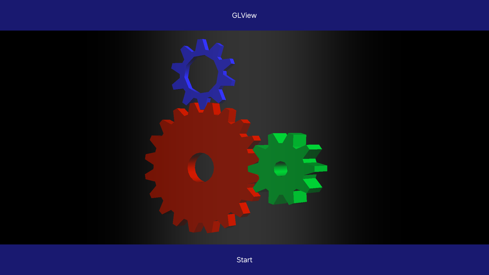

# GLViewSample
This app shows how to use GLView. GLView is a View. So you can use it with the other components and add it to layouts.

There are two ways to use OpenGL ES.
In C#, you can use OpenTK. If you want to use the native OpenGL ES library, you can register native symbols to its callbacks. You can check how to create a SO file in the GLViewSampleNativeSo directory.

## Preview
* Screenshot
</th>


## Programming guide
GLView has a context, target surface, and GL rendering thread.  
You can register three callbacks related to GL calls.
```csharp
public void RegisterGLCallbacks(GLInitializeDelegate glInit, GLRenderFrameDelegate glRenderFrame, GLTerminateDelegate glTerminate)
```
And you should set the ViewResizeDelegate when the view can be resized.
```csharp
public void SetResizeCallback(ViewResizeDelegate callback)
```

The GL rendering thread calls the three GL callbacks and the resize callback. So you don't have to consider syncing threads. But when you handle events that change rendering status, You have to add mutex locks because event handling callbacks in NUI are invoked in the main(event) thread.

You can use native symbols like below. The `initializeGL()` is in the `libglview-callbacks.so.0.0.1 file`.

```csharp
const string lib = "libglview-callbacks.so.0.0.1";
[global::System.Runtime.InteropServices.DllImport(lib, EntryPoint = "initializeGL")]
public static extern void initializeGL();
```