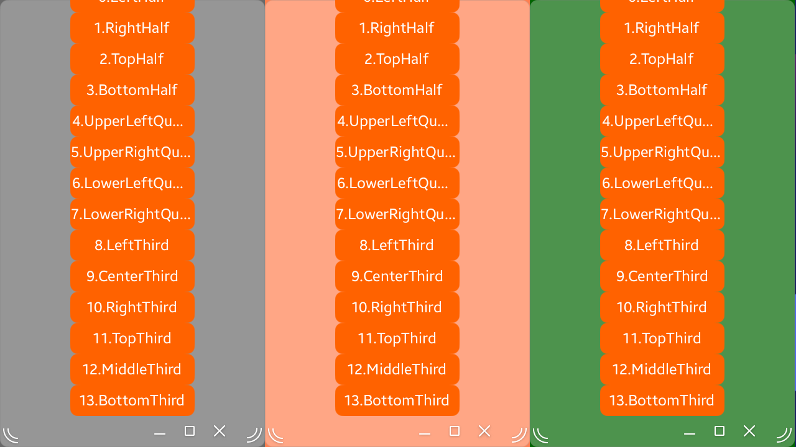
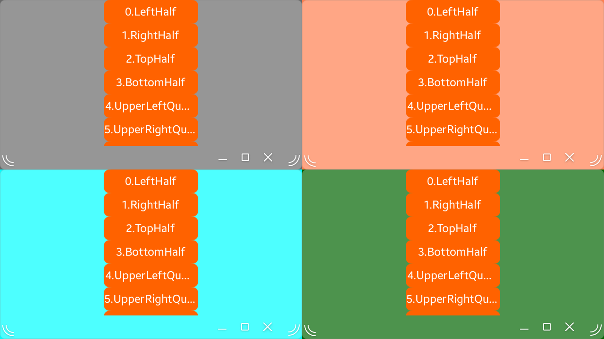

# NUIWindowLayout
This app shows how to use the WindowLayout feature.
When you use Window.SetLayout(), you can move and resize the window, for instance moving and resizing the window to the left half of the screen.

## ScreenShot
+ LeftThird, CenterThird, RightThird

+ UpperLeftQuarter, UpperRightQuarter, LowerLeftQuarter, LowerRightQuarter
