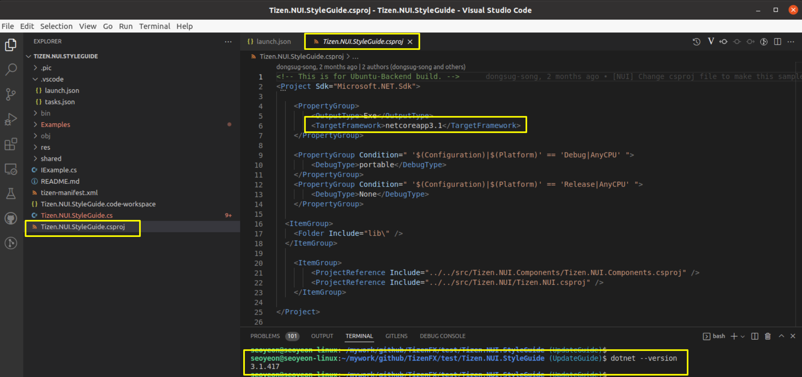

# Tizen.NUI.StyleGuide project for Ubuntu build and debug
- **Dali** Ubuntu build and **tizenfx-stub** Ubuntu build should be done(be set up) before running this project.
- Please check this references first : [NUI Ubuntu guide](https://code.sec.samsung.net/confluence/display/GFX/NUI+running+on+Ubuntu+backend), [DALi Ubuntu guide](https://code.sec.samsung.net/confluence/display/GFX/DALi+Getting+Started+Guide)

### nuget.config
- Please check the ~/.nuget/NuGet/NuGet.Config file to set nuget package sources.
- At least, these 2 sources should be included : https://tizen.myget.org/F/dotnet/api/v3/index.json, https://api.nuget.org/v3/index.json

### VS Code related setting
- Please change the paths shown blow as for your environment.
- .vscode/launch.json

### csproj file
- Set the target framework installed in your environment.
- Tizen.NUI.StyleGuide.csproj

### Start debugging
- Open VS Code by the command, **"$ code Tizen.NUI.StyleGuide.code-workspace"** in /TizenFX/test/Tizen.NUI.StyleGuide/ folder.
- Do run and debug by clicking "play button" as shown below

